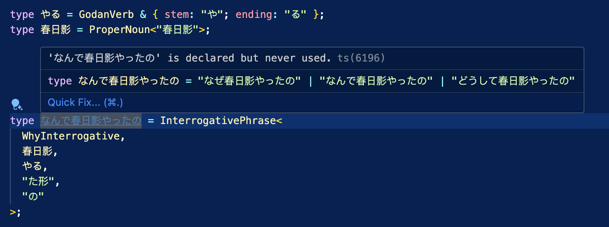

# 🌸 Typed Japanese

**If you can write TypeScript, you can write and understand Japanese!**



Typed Japanese is a TypeScript type-level library that enables the expression of complete Japanese sentences through the type system. It creates a domain-specific language (DSL) based on Japanese grammar rules, allowing a subset of grammatically correct natural language to be written and verified using TypeScript's compiler.

This project also explores an intermediate format for AI in language learning. For example, LLMs could return grammar analysis of Japanese sentences using this format instead of JSON, enabling verification through TypeScript's type checker to improve correctness.

```typescript
// I-adjective "ii" (good) with irregular conjugation
// Then add particle "yo" to basic form of "ii" -> "ii yo"
type いい = IAdjective & { stem: "い"; ending: "い"; irregular: true };
type いいよ = PhraseWithParticle<ConjugateAdjective<いい, "基本形">, "よ">;

// Irregular verb "kuru" (to come)
// Then add particle "yo" to imperative form of "kuru" -> "koi yo"
type 来る = IrregularVerb & { dictionary: "来る" };
type 来いよ = PhraseWithParticle<ConjugateVerb<来る, "命令形">, "よ">;

// Connect both phrases -> "ii yo, koi yo"
type いいよ来いよ = ConnectedPhrases<いいよ, 来いよ>;

// Type checking examples
const correctPhrase1: いいよ = "いいよ"; // "It's good!"
const correctPhrase2: 来いよ = "来いよ"; // "Come here!"
const correctFullPhrase: いいよ来いよ = "いいよ、来いよ"; // "It's good, come here!"
```

## 🤖 Verb System

### Verb Classes

Japanese verbs are categorized into three main classes:

1. **Godan Verbs (五段動詞)** - Also known as "Group 1" or "u-verbs"

   - Endings: う, く, ぐ, す, つ, ぬ, ぶ, む, る
   - Examples: 話す (hanasu - to speak), 書く (kaku - to write)

2. **Ichidan Verbs (一段動詞)** - Also known as "Group 2" or "ru-verbs"

   - Always end with る
   - Examples: 食べる (taberu - to eat), 見る (miru - to see)

3. **Irregular Verbs (不規則動詞)** - Only two main verbs
   - する (suru - to do)
   - 来る (kuru - to come)

### Verb Conjugation Forms

The system supports these conjugation forms:

- 辞書形 (Dictionary form)
- ます形 (Polite form)
- て形 (Te form)
- た形 (Past form)
- ない形 (Negative form)
- 可能形 (Potential form)
- 受身形 (Passive form)
- 使役形 (Causative form)
- 意向形 (Volitional form)
- 命令形 (Imperative form)
- 条件形 (Conditional form)
- 仮定形 (Hypothetical form)

```typescript
type 買う = GodanVerb & { stem: "買"; ending: "う" };
type 買うて形 = ConjugateVerb<買う, "て形">; // 買って
type 買うた形 = ConjugateVerb<買う, "た形">; // 買った

type 食べる = IchidanVerb & { stem: "食べ"; ending: "る" };
type 食べるて形 = ConjugateVerb<食べる, "て形">; // 食べて
type 食べるた形 = ConjugateVerb<食べる, "た形">; // 食べた
```

## 🎨 Adjective System

Japanese adjectives are categorized into two main classes:

1. **I-Adjectives (い形容詞)** - End with い

   - Examples: いい (good), 楽しい (fun), 高い (expensive)

2. **Na-Adjectives (な形容詞)** - Require な when modifying nouns
   - Examples: 綺麗 (pretty), 静か (quiet), 好き (liked)

### Adjective Conjugation Forms

The system supports these conjugation forms for adjectives:

- 基本形 (Basic form)
- 丁寧形 (Polite form)
- 過去形 (Past form)
- 否定形 (Negative form)

```typescript
type いい = IAdjective & { stem: "い"; ending: "い"; irregular: true };
type 綺麗 = NaAdjective & { stem: "綺麗" };
```

## 📚 Phrase and Sentence Composition

The system now supports:

- Adjectives and verbs with particles
- Connecting phrases with Japanese punctuation
- Basic sentence structures
- Conditional expressions with particles like なら
- Demonstrative forms with actions

```typescript
// Example of a conditional phrase using a proper noun and demonstrative action
// Define the proper noun "ヒンメル"
type ヒンメル = ProperNoun<"ヒンメル">;

// Define する verb
type する = IrregularVerb & { dictionary: "する" };

// Create the そうした pattern (past form of そうする)
type そうした = DemonstrativeAction<Demonstrative & "そう", する, "た形">;

// Create the conditional phrase "ヒンメルならそうした"
type ヒンメルならそうした = ConditionalPhrase<ヒンメル, "なら", そうした>;

// Type checking examples
const properExample: ヒンメルならそうした = "ヒンメルならそうした"; // "If it were Himmel, I would do so"
```

## ⚙️ Technical Implementation

The system uses TypeScript's template literal types, conditional types, and mapped types to create a purely type-level representation of Japanese grammatical rules.

Key components:

- Type definitions for grammatical elements
- Rule mapping via conditional types
- String literal manipulation for form generation
- Type inference for grammatical validation

## 💡 Why Typed Japanese?

- **Educational tool** - Learn Japanese grammar through code
- **AI-assisted learning** - Provide structured formats for language analysis
- **Grammar verification** - Express and verify Japanese grammar in code
- **Integration potential** - Basis for typed Japanese language tools

## ⚠️ Limitations

- This is a type-level system only - it doesn't provide runtime functionality
- The system handles standard forms but doesn't account for linguistic nuances
- Some rare or archaic language patterns may not be accurately represented

This project is still in very early stages and heavily relies on LLM-generated grammar rules, which may occasionally contain hallucinations or inaccuracies. If you find any issue during actual use, please help by confirming and providing feedback.

## 🛠️ Development

If you're interested in contributing to or experimenting with Typed Japanese:

1. Ensure you have [Node.js](https://nodejs.org/) and [pnpm](https://pnpm.io/) installed
2. Clone the repository
3. Install dependencies: `pnpm install`
4. Run the tests: `pnpm test`

The tests validate that the type system functions correctly and all grammatical rules are properly implemented.

We welcome contributions! Feel free to open issues for bugs or feature requests, or submit pull requests with improvements.

## 📬 Contact

For sponsorship opportunities, research collaborations, or commercial inquiries, please reach out to `doodlewind [at] gmail [dot] com` or [@ewind_dev](https://x.com/ewind_dev).

## 📄 License

[MIT](https://opensource.org/licenses/MIT)

Copyright (c) 2025-present, Yifeng Wang
